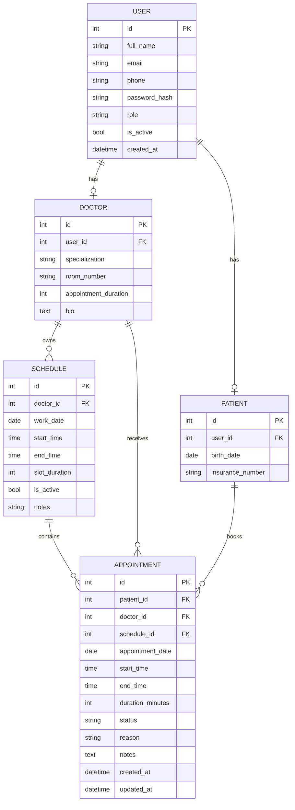

# Системный анализ проекта ClinicFlow

## 1. Название проекта

**Автоматизированная система расписания для клиник**

## 2. Цель системы

Разработать веб-приложение, которое автоматизирует запись пациентов к врачам, помогает управлять расписанием и минимизирует время ожидания пациентов за счет более рационального распределения слотов.

## 3. Проблема предметной области

При ручном ведении записи в клинике возникают типовые проблемы:
- двойное бронирование времени;
- длительные простои врача;
- большие промежутки между приемами;
- сложность переноса и отмены записи;
- отсутствие единого интерфейса для пациентов, врачей и администраторов;
- низкая прозрачность текущей загрузки клиники.

Система ClinicFlow решает эти проблемы за счет цифрового расписания и автоматической проверки доступности слотов.

## 4. Участники системы

### Пациент

Может:
- зарегистрироваться и войти;
- просматривать доступных врачей;
- выбрать дату и время приема;
- записаться на прием;
- отменить свою запись;
- видеть свои будущие и прошлые записи.

### Врач

Может:
- войти в систему;
- просматривать свое расписание;
- добавлять рабочие интервалы;
- видеть список ближайших приемов.

### Администратор

Может:
- просматривать все записи;
- управлять врачами;
- управлять пациентами;
- переносить и отменять записи;
- контролировать загруженность клиники;
- активировать и деактивировать пользователей.

## 5. Функциональные требования

Система должна обеспечивать:
- регистрацию пользователей;
- аутентификацию и разграничение ролей;
- создание и хранение профиля врача;
- создание и хранение профиля пациента;
- добавление рабочих графиков врачей;
- генерацию временных слотов на основе расписания;
- проверку доступности слота;
- создание записи на прием;
- защиту от повторной записи;
- отмену записи;
- перенос записи;
- повторное освобождение слота после отмены;
- отображение статистики по загрузке клиники;
- вывод рекомендуемого слота для более плотного расписания.

## 6. Нефункциональные требования

Система должна быть:
- простой в использовании;
- понятной для учебного проекта;
- запускаемой локально без сложной инфраструктуры;
- устойчивой к базовым ошибкам ввода;
- пригодной для дальнейшего расширения.

## 7. Основные бизнес-правила

1. Один активный слот врача не может быть забронирован дважды.
2. Пациент не может иметь две активные записи на пересекающееся время.
3. Запись можно создать только на основе существующего активного расписания.
4. Отмененная запись освобождает слот.
5. Перенос записи возможен только на доступный слот.
6. Администратор не может деактивировать сам себя.
7. Создание нового администратора доступно только действующему администратору.

## 8. Варианты использования

### UC-1. Регистрация пациента

Предусловие:
- пользователь еще не зарегистрирован.

Сценарий:
1. Пользователь открывает страницу регистрации.
2. Заполняет форму.
3. Система валидирует данные.
4. Система создает учетную запись и профиль пациента.

### UC-2. Запись на прием

Предусловие:
- пациент авторизован;
- у врача есть активное расписание.

Сценарий:
1. Пациент выбирает врача.
2. Пациент выбирает дату.
3. Система показывает свободные слоты.
4. Пациент подтверждает запись.
5. Система проверяет пересечения и сохраняет запись.
6. Пользователь получает уведомление о подтверждении.

### UC-3. Перенос записи администратором

Предусловие:
- администратор авторизован;
- запись существует и не отменена.

Сценарий:
1. Администратор выбирает существующую запись.
2. Указывает новую дату и время.
3. Система проверяет доступность нового слота.
4. Если слот недоступен, система предлагает ближайший свободный вариант.
5. Если слот доступен, система обновляет запись и меняет статус на `rescheduled`.

### UC-4. Добавление расписания врача

Предусловие:
- врач или администратор авторизован.

Сценарий:
1. Пользователь открывает страницу расписания.
2. Заполняет дату, время начала, окончания и длительность слота.
3. Система валидирует интервал.
4. Система сохраняет рабочий период.

## 9. ER-диаграмма

## 10. Описание алгоритма оптимизации

В проекте используется простой эвристический алгоритм.

### Шаг 1. Генерация слотов

Для каждого активного интервала работы врача создаются временные слоты по `slot_duration`.

Пример:
- рабочий интервал: 09:00-11:00;
- длительность слота: 30 минут;
- слоты: 09:00, 09:30, 10:00, 10:30.

### Шаг 2. Фильтрация занятых слотов

Система выбирает уже существующие записи врача на эту дату и исключает все слоты, которые пересекаются с ними.

### Шаг 3. Оценка плотности расписания

Для каждого свободного слота считается показатель `efficiency_score`:
- анализируется разрыв до предыдущего приема;
- анализируется разрыв после следующего приема;
- слот получает лучший приоритет, если примыкает к соседним приемам.

### Шаг 4. Выбор рекомендуемого слота

Из всех свободных слотов выбирается слот с минимальным `efficiency_score`.

Это позволяет:
- уменьшать пустые окна в графике врача;
- снижать простои;
- делать расписание более плотным.

### Шаг 5. Поиск ближайшего альтернативного времени

Если пользователь пытается записаться в уже занятый слот, система ищет ближайший доступный слот на текущую дату, а затем на последующие даты в пределах заданного диапазона.

## 11. Архитектура решения

### Уровень представления

HTML-шаблоны Jinja2:
- `base.html`
- `index.html`
- `login.html`
- `register.html`
- `appointments.html`
- `schedule.html`
- `admin.html`

### Уровень логики

Файл `routes.py`:
- обработка запросов;
- валидация форм;
- проверка доступа по ролям;
- бизнес-логика записи, отмены и переноса.

### Уровень данных

Файл `models.py`:
- описание сущностей;
- связи между таблицами;
- ограничения и индексы;
- генерация тестовых данных.

## 12. Ограничения текущей версии

Текущая версия учебная, поэтому:
- уведомления реализованы как статусы и сообщения в интерфейсе, без реальной отправки email или SMS;
- отсутствует REST API;
- нет полноценного аудита действий пользователей;
- нет автоматических тестов;
- нет разделения на Flask Blueprint-модули по подсистемам.

## 13. Возможные направления развития

- подключение Flask-WTF для более строгой валидации форм;
- внедрение Flask-Login для полноценной сессии пользователя;
- email- и SMS-уведомления;
- календарное представление расписания;
- экспорт в PDF и Excel;
- аналитика по популярным врачам и времени пиковой нагрузки;
- интеграция с медицинской информационной системой.
